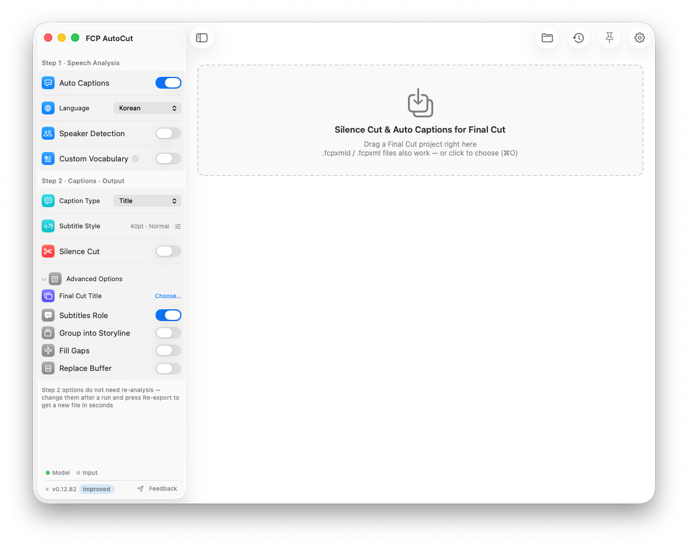
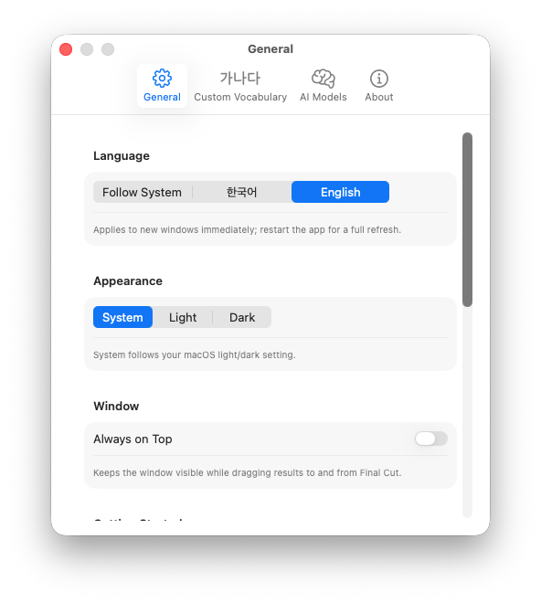
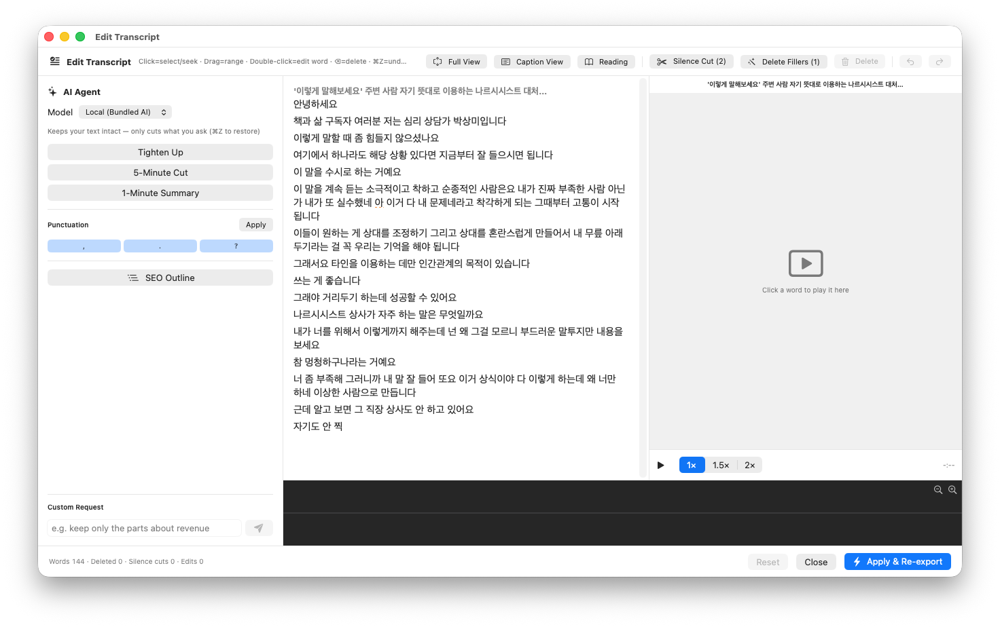
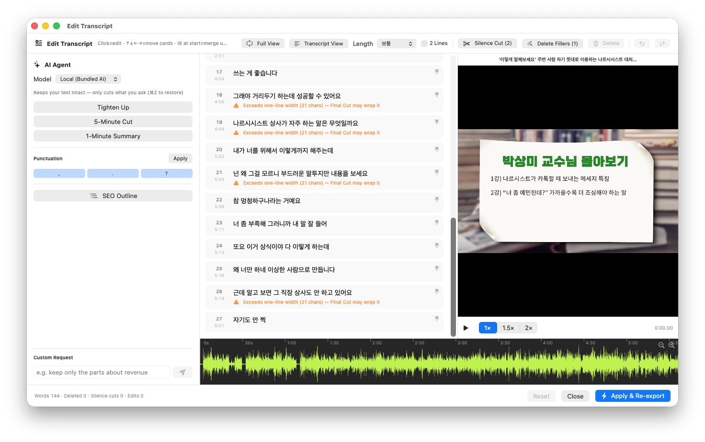
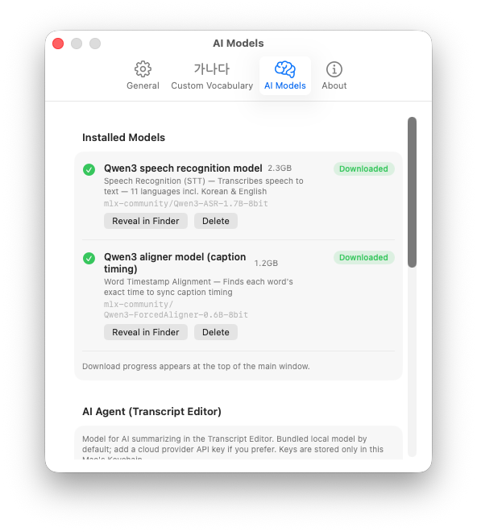
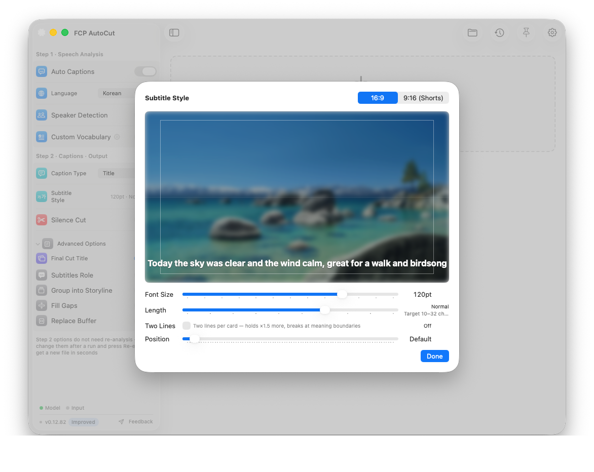
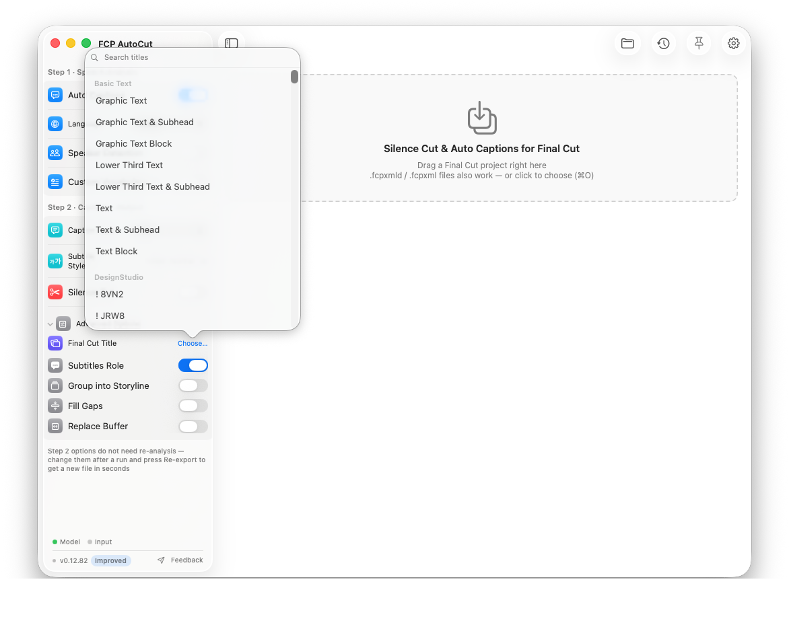
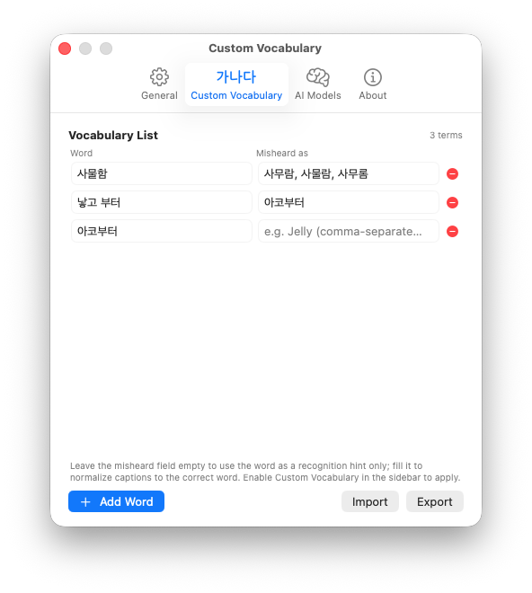
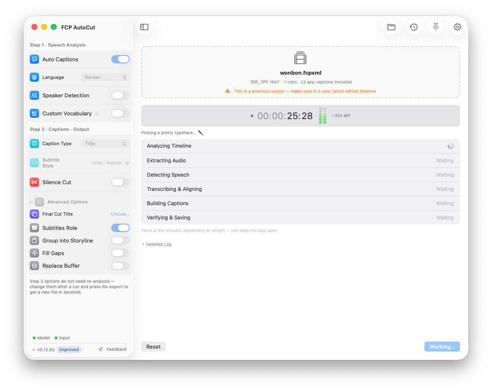
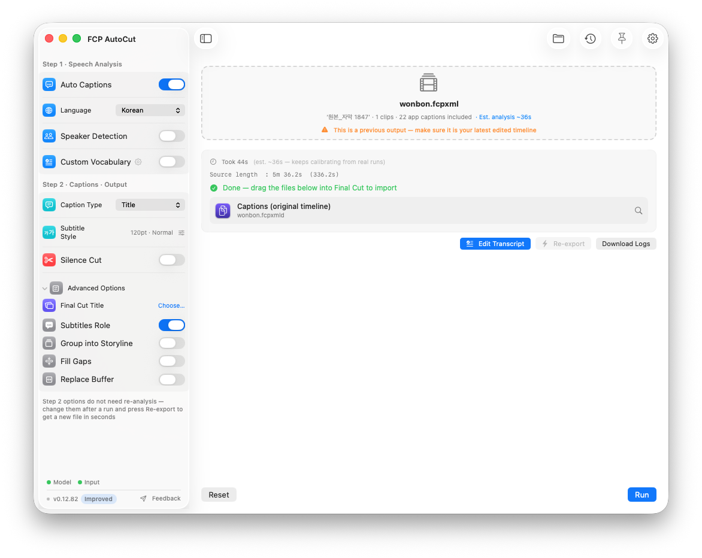

<a href="README.md">🇰🇷 한국어</a> · 🇺🇸 <b>English</b>

  

<h1 align="center">FCP AutoCut (beta)</h1>

  <b>Drag your Final Cut project in — it removes silence, adds captions, and lets you edit the video as text</b> 
  then hands it back to Final Cut Pro. The boring half of cut editing, done in minutes. 
  <b>Everything runs on your Mac.</b> Your footage never leaves your machine.

  
  
  
  
  
  

  
   Main window — pick options in the sidebar (<b>Step 1: Speech Analysis → Step 2: Captions · Output</b>), drop your project onto the dashed box, done. Rarely-used options stay folded under <b>Advanced Options</b>.

---

## Who it's for

Anyone editing <b>talk-heavy long-form</b> in Final Cut Pro — interviews, lectures, sermons, podcasts, YouTube. The hours you spent cutting silence one gap at a time and typing captions by hand — **FCP AutoCut does that for you.** Results always come back as a **new project**, so your original stays untouched.

## Download

👉 Grab the latest DMG from **[Releases](../../releases)**. After installing, the **"Update Now" button inside the app** fetches every later version for you.

| Requirements | |
|---|---|
| Mac | **Apple Silicon (M1 or later)** — Intel Macs not supported |
| macOS | 14 (Sonoma) or later |
| Final Cut Pro | 10.x – 12.3 |
| Disk | One-time AI speech model download, ~**3.5GB** (optional features download extra) |

> 💬 **Questions, bugs, feature requests** — open a [GitHub Issue](../../issues)!

---

## Why FCP AutoCut

- **⚡ No export step** — other tools make you **render the video or extract audio** before they can transcribe. FCP AutoCut deletes that entire step: **drag the project you're editing** and it analyzes your cut timeline's audio directly — going straight from **caption generation to Text-Based Editing**.
- **🔒 100% on your Mac** — speech recognition, captions, editing, AI cleanup: all on-device. Nothing is uploaded.
- **♻️ Fully non-destructive** — results always come back as a **new project**. Adjustment layers, B-roll, connected storylines, and your cut structure are preserved.
- **🎬 Native to Final Cut** — captions are generated as **native FCP titles** from the start, so there's nothing to swap and nothing drifts on mixed frame rates.
- **👀 What you see is what you get** — caption size and position in the app match **Final Cut's actual render 1:1**.
- **🌐 English & 한국어** — fully bilingual UI, logs and progress messages. Switch anytime in Settings › General.

  

---

## What it can do

### ✂️ Silence Cut — trim only the dead air

Automatically finds and removes the gaps between phrases. **Cut strength (gentle to aggressive)** controls how tightly it trims, and the rest of your edit structure is left alone. Your original timeline stays put — you get a separate **compressed version** with the silence removed.

### 💬 Auto Captions — exactly what was said

- **Local AI speech recognition (Qwen3-ASR)** + **word-level forced alignment** produce captions that stick to the speech.
- **Hears every audio item in the timeline** — connected clips and connected storylines included, regardless of nesting.
- **Splits on meaning** — reads the whole sentence and breaks where it reads best.
- **Punctuation with rules** — question marks only on real questions, commas only where the speaker actually paused. Codified rules, consistent results.
- **No language drift** — an English video gets English captions from start to finish.
- **No captions over music** — hallucinated captions are blocked by audio analysis.
- **Language selection** (Korean, English, and more), caption format (**Title / Caption / both**).

### 📝 Transcript Editor — edit video like a document

When analysis finishes, the **[Edit Transcript]** button opens a **window that feels like a word processor**. Read the transcript, delete what you don't need, and **that span is cut from the timeline**. Your words are never rewritten, and every edit is undoable with **⌘Z**.

  
   Transcript editor — the <b>transcript</b> in the middle, <b>video preview</b> (live captions) on the right, <b>waveform</b> below, and the <b>AI Agent</b> on the left.

- **Like a document** — drag to select, click to play from there, **double-click to fix a word in place**. Readable paragraphs per sentence, plus **Reading view** (large type) and **Full view**.
- **Delete = cut** — deleted spans are cut from the exported timeline (captions untouched), and playback **skips them automatically**.
- **One-click cleanup** — Silence Cut and Filler Cut buttons for the whole transcript.
- **Preview + waveform** — watch with captions on the side; click the waveform to jump, and the text scrolls along. **Space plays from the cursor.**

#### 💬 Caption view — polish caption by caption (CapCut style)

Prefer working with caption cards instead of prose? Switch to Caption View in the toolbar.

  
   Caption view — numbered, timecoded cards. Adjust <b>caption length and 2-line mode</b> right from the toolbar.

- **One card = one caption** exactly as it will export, numbered so the flow is easy to scan.
- **⌫ at the start of a caption** merges it with the previous one. **⌘Enter** splits at the cursor. Arrow keys move between cards.
- The toolbar **length slider + 2-line toggle** reflows the entire set instantly — synced with the sidebar's Subtitle Style.
- Your merges and splits **carry through to the exported result**.

### 🤖 AI Agent — tell it, and it edits

Hand the editing to the AI on the left side of the Transcript Editor. **It never rewrites your text — it only cuts what you ask**, and every result can be reviewed and restored.

- **Summarize & extract** — "keep the essentials" · "down to 5 minutes" · "1-minute cut", or free-form like *"keep only the sales talk"*. Sentences are scored by importance and kept **essentials-first** to hit the target length.
- **Google SEO outline** — organizes the transcript under **H2/H3 headings** with a table of contents; **delete whole sections** from the outline to shape the story fast.
- **Punctuate** — fills in periods, question marks, and commas **by codified rules** (question marks only on real questions, commas only on real pauses — no false positives).
- **Offline by default** — runs on the bundled local AI. Want more power? Add **OpenAI · Gemini · Claude** API keys in Settings (stored only in this Mac's Keychain).

  
   Settings › AI Models — inspect and manage the installed speech models, and optionally register cloud API keys.

### 🎨 Subtitle style & titles — finished from the start

- **Live preview** — adjust font size, caption length, **2-line captions**, and position with instant feedback. The input project's **aspect ratio (16:9/9:16) is auto-detected**, and 9:16 shows **YouTube · Instagram · TikTok safe-zone guides**.

  
   Subtitle Style — what you see in the preview matches <b>Final Cut's actual render 1:1</b>. Slider changes apply instantly.

- **No title swapping, ever** — with other tools, swapping the title style in FCP resets durations and wrecks the timeline. FCP AutoCut **generates captions with your chosen title's native values from the start**, so that never happens. **FCP 12.3 Subtitle titles + the Subtitles role** are supported too (select all, batch edit).
- **Your own titles, as-is** — **drag a Final Cut title in, or pick one from the "Choose…" list**, and captions are generated in that title. Installed titles (built-in + third-party) are auto-scanned, with a cache so the list opens instantly.

  
   Final Cut Title › Choose… — search and pick anything from built-in titles to your third-party installs.

- **Mixed frame rates are safe** — a 30p project with 29.97fps sources still aligns captions exactly on media frames (no warnings).

### 🎚️ Want more control?

| Option | What it does |
|---|---|
| **Speaker diarization** | Gives each speaker a different-colored role (no two speakers in one caption). **Pin the speaker count to auto / 2 / 3 / 4** to prevent over-splitting. |
| **High-precision diarization** | For panels and interviews with crosstalk. An overlap-aware model (pyannote) separates **even simultaneous speech per speaker** (HuggingFace token required, set in Settings). |
| **Group into a storyline** | Outputs caption titles as **one connected storyline** — easy to move and manage as a unit. Works on the silence-cut version too. |
| **Filler cut** | Removes stranded "uh / um" fillers and coughs. **Mild / medium / strong** — from pure fillers up to discourse markers. |
| **Custom vocabulary** | Register names, brands, and jargon that ASR keeps mishearing; captions are normalized to the correct word. Review window before applying; **export/import** the dictionary. **Fix a word straight from the Transcript Editor** too. |

  
   Settings › Custom Vocabulary — register the correct word plus the misheard variants, and captions come out unified.

---

## How to use — 3 steps

1. **Drop it in** — grab your project in Final Cut Pro and drag it onto the app's dashed box
2. **Run** — turn on the options you want and hit Run. Progress and time remaining are shown
3. **Get it back** — drag the result file into Final Cut → it **imports as a new project** (non-destructive)

  
   Running — stage-by-stage progress with <b>time remaining</b>, plus a live timecode clock.

  
   Done — drag the result <b>straight into Final Cut</b>. Continue with <b>[Edit Transcript]</b>, or tweak options and <b>Re-export</b> in seconds without re-analysis.

> Depending on options you'll get **① the original timeline + captions**, and/or **② a silence-cut / edited timeline + captions**.
> Processed projects live in **Job History (up to 50)** with one-click access to each result folder.

## Install & first launch

1. Open the DMG and drag **FCP AutoCut** into **Applications**
2. **Allow it once** — the beta isn't Apple-notarized yet, so macOS blocks the first launch:
   double-click the app → click **Done** on the alert → **System Settings → Privacy & Security** → **Open Anyway** → enter your password. From then on it opens normally.
3. On first run the app downloads the AI speech model (~3.5GB) once — after that everything works offline.

## Privacy

All AI processing is on-device. The app works without a network connection; your video and audio are never uploaded anywhere.

## Feedback 🙏

Bug reports and feature requests: [GitHub Issues](../../issues) — the in-app **Feedback** button attaches logs automatically.

<a href="README.md">🇰🇷 한국어로 보기</a>

