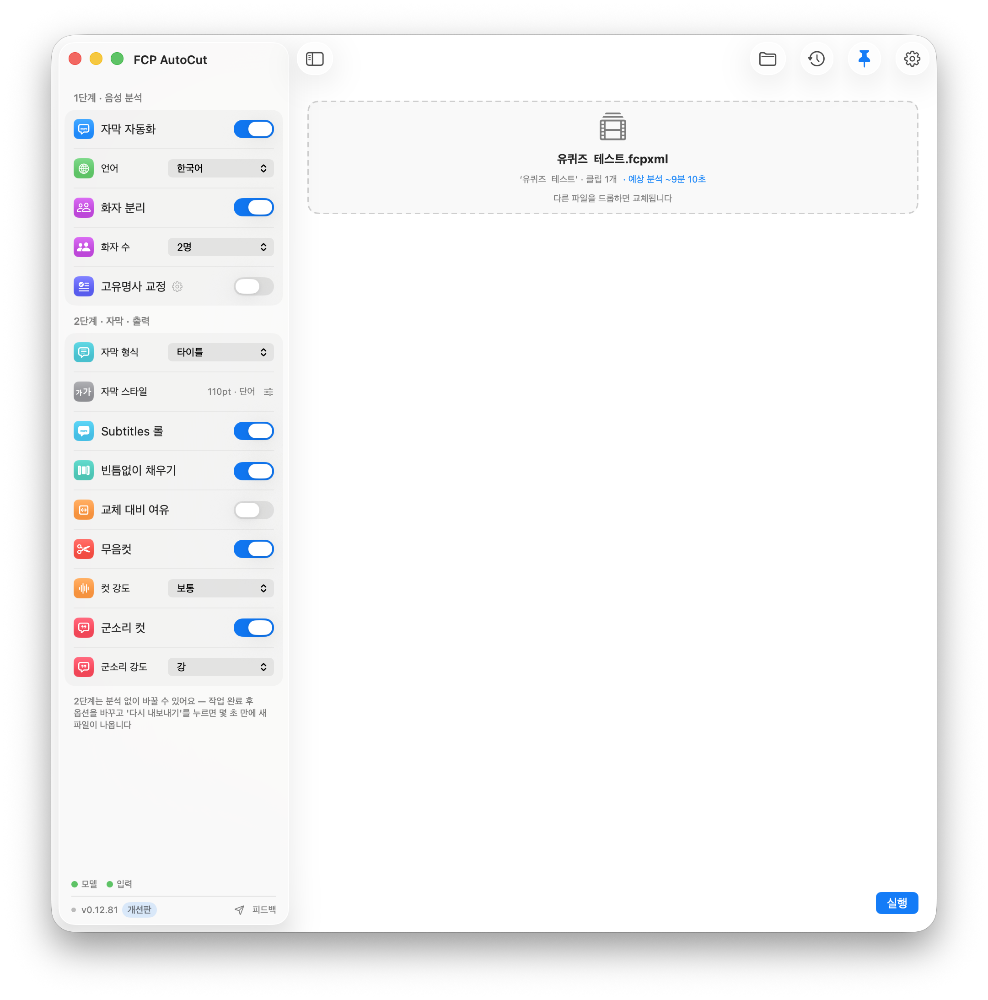
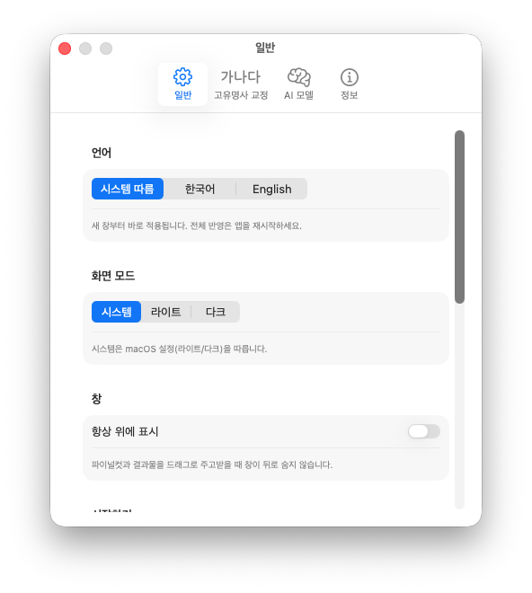
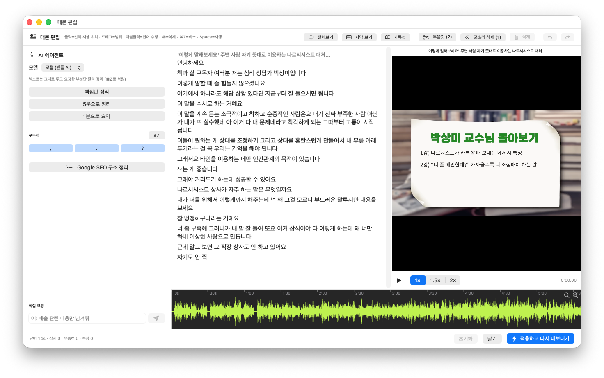
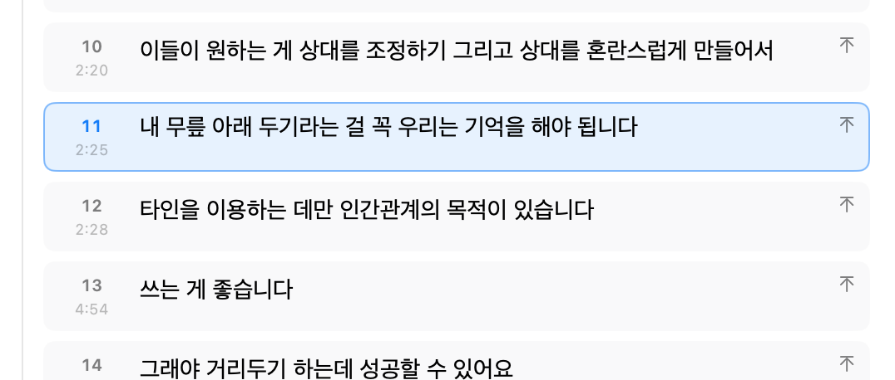
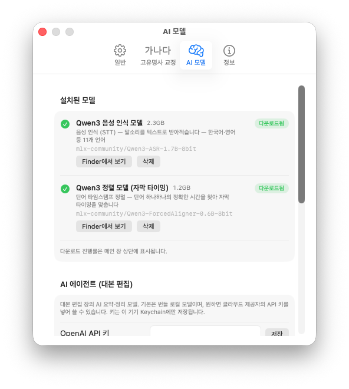
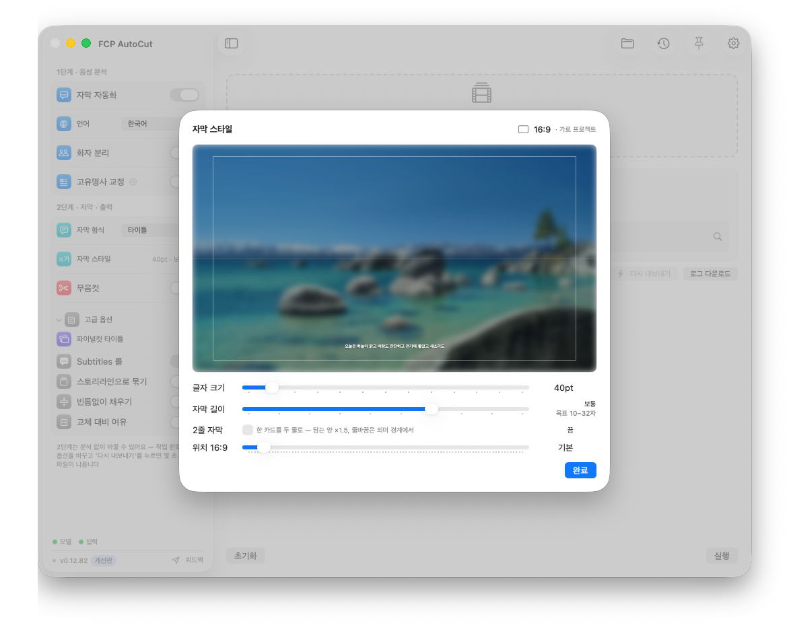
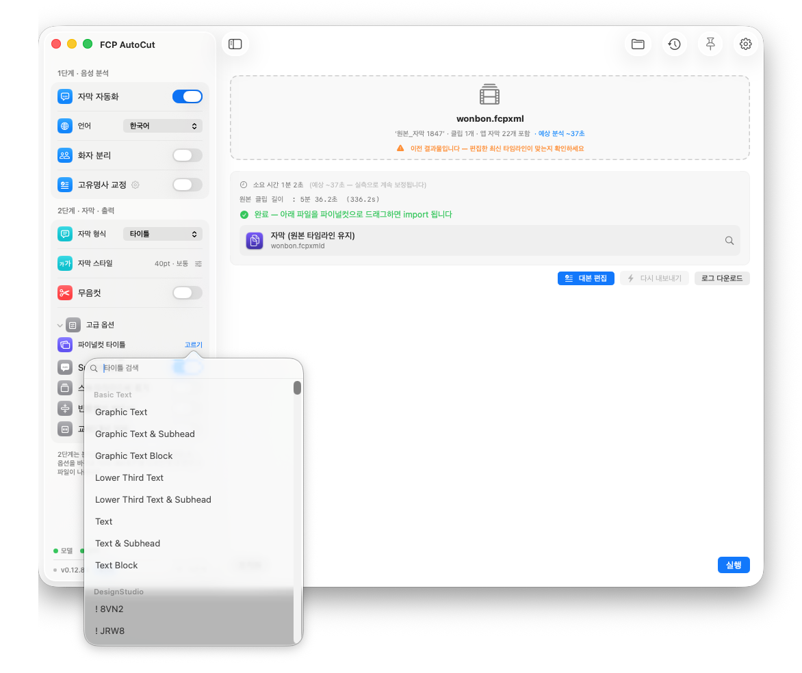
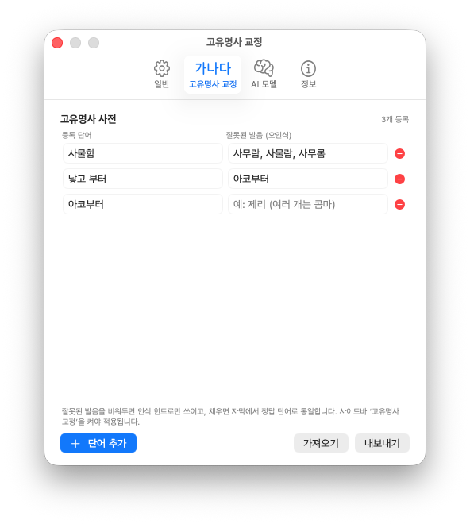
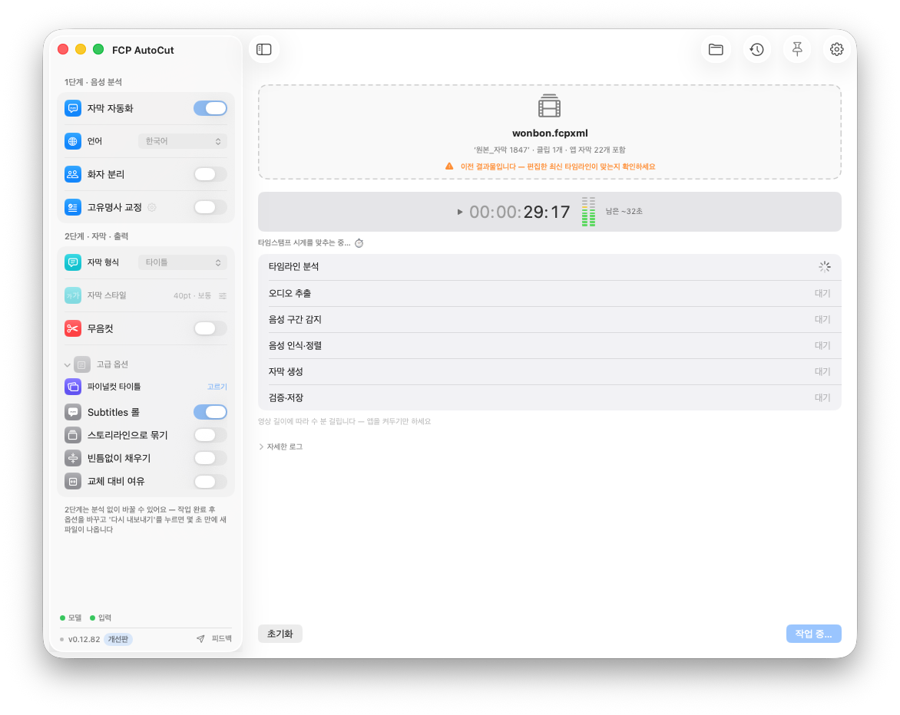
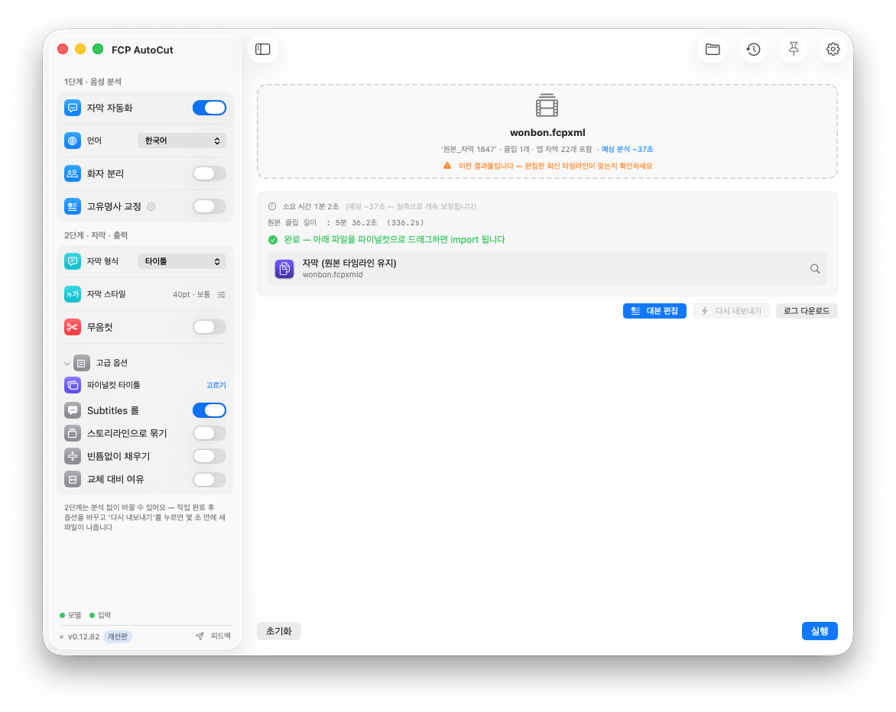

  

<h1 align="center">FCP AutoCut (beta)</h1>

  <b>파이널컷 프로젝트를 드래그하면 — 무음을 잘라내고, 자막을 입히고, 대본까지 텍스트로 편집해</b> 
  다시 파이널컷으로 돌려주는 맥앱. 컷 편집의 지루한 뒷일을 몇 분으로 줄여줍니다. 
  <b>모든 처리는 내 Mac 안에서만.</b> 영상이 외부 서버로 나가지 않습니다.

  
  
  
  
  
  
  

  
   메인 화면 — 왼쪽 사이드바에서 <b>1단계(음성 분석) → 2단계(자막·출력)</b> 순서로 옵션을 고르고, 프로젝트를 점선 박스에 떨어뜨리면 끝. 자주 안 쓰는 옵션은 <b>고급 옵션</b>에 접혀 있습니다.

---

## 이런 분께

인터뷰 · 강의 · 설교 · 팟캐스트 · 유튜브 같은 **말이 많은 롱폼**을 파이널컷으로 편집하는 분.
말 사이의 침묵을 일일이 자르고, 자막을 손으로 치고, 필요 없는 부분을 골라내던 그 시간을
**FCP AutoCut이 대신합니다.** 결과는 언제나 **새 프로젝트**로 돌려받으니 원본은 그대로예요.

## 다운로드

👉 **[Releases](../../releases)** 페이지에서 최신 DMG를 받으세요. 설치 후에는 **앱 안의 "지금 업데이트"** 버튼으로 이후 버전을 바로 받을 수 있습니다.

| 요구 사항 | |
|---|---|
| Mac | **Apple Silicon (M1 이상)** — Intel Mac 미지원 |
| macOS | 14 (Sonoma) 이상 |
| Final Cut Pro | 10.x ~ 12.3 |
| 디스크 | 최초 1회 AI 음성 모델 약 **3.5GB** (선택 기능은 추가 다운로드) |

> 💬 **베타 테스터 오픈채팅방** — 설치 도움 · 버그 제보 · 업데이트 소식 · 기능 요청은 여기로!
> 👉 **[카카오톡 오픈채팅 참여하기](https://open.kakao.com/o/grDKAwCi)**

---

## 왜 FCP AutoCut인가

- **⚡ 내보내기 과정이 없다** — 다른 도구는 음성 인식을 위해 **영상을 렌더링하거나 오디오를 따로 추출**해서 넣어야 하죠. FCP AutoCut은 그 과정이 통째로 사라집니다. **편집하던 프로젝트를 그대로 드래그**하면, 컷편집된 타임라인의 오디오를 그대로 분석해 **자막 생성부터 Text-Based Editing(대본 기반 편집)까지** 바로 이어집니다.
- **🔒 100% 내 Mac에서** — 음성 인식·자막·편집·AI 정리까지 전부 온디바이스. 영상·음성이 밖으로 나가지 않습니다.
- **♻️ 완전 비파괴** — 결과는 항상 **새 프로젝트**로 나옵니다. 어저스트먼트 레이어·B롤·보조 스토리라인·컷 구조를 그대로 보존해요.
- **🎬 파이널컷에 딱 맞게** — 자막이 처음부터 **FCP 네이티브 타이틀**로 만들어져 교체할 필요가 없고, 혼합 프레임레이트에서도 어긋나지 않습니다.
- **👀 보이는 그대로** — 앱에서 본 자막 크기·위치가 **파이널컷 실제 렌더와 1:1로 일치**합니다.
- **🌐 English & 한국어** — 앱 UI·로그·진행 메시지까지 **영어/한국어 완전 이중언어**. 설정 › 일반에서 언제든 전환(시스템 따름 / 한국어 / English).

  

---

## 무엇을 할 수 있나요

### ✂️ 무음컷 — 침묵만 걷어내기

말과 말 사이의 빈 구간을 자동으로 찾아 잘라냅니다. **컷 강도(약~매우 강)**로 얼마나 촘촘히 자를지 고르고, 나머지 편집 구조는 손대지 않아요. 원본 타임라인은 그대로 두고, 무음을 제거해 **압축된 버전**을 따로 만들어 줍니다.

### 💬 자막 자동화 — 말하는 대로, 정확하게

- **로컬 AI 음성 인식(Qwen3-ASR)** + **단어 단위 정밀 타이밍(Forced Aligner)** 으로 말에 딱 붙는 자막을 만듭니다.
- **타임라인의 모든 오디오를 인식** — 메인 스토리라인은 물론 커넥트 클립·연결 스토리라인('스토리라인 만들기')에 붙인 오디오까지, 연결 방식·중첩 깊이와 무관하게 찾아냅니다.
- **의미 단위로 자연스럽게 분리** — 문장 전체를 보고 가장 읽기 좋은 곳에서 끊습니다. "말하고 싶은" · "수 있도록" · "열한 명" 같은 덩어리를 어색하게 쪼개지 않아요.
- **구두점도 기준 있게** — 물음표는 진짜 질문에만, 쉼표는 실제로 말을 쉰 곳에만. 명문화된 규칙(구두점 바이블)대로 동작해 결과가 늘 일관됩니다.
- **언어가 흔들리지 않게** — 자동 모드에서 영어 영상은 **처음부터 끝까지 영어 자막**으로. 구간마다 번역이 오락가락하지 않습니다.
- **음악 구간엔 자막 없음** — 음성이 아닌 구간(BGM·효과음)에서 생기는 환청 자막을 오디오 분석으로 걸러냅니다.
- **한국어·영어 등 언어 선택**, 자막 형식(**타이틀 / 캡션 / 둘 다**) 선택.

### 📝 대본 편집기 — 영상을 '글'처럼 편집

분석이 끝나면 **[대본 편집]** 버튼으로 **문서 편집기 같은 창**이 열립니다. 대본을 읽으며 필요 없는 부분을 지우면, **그 구간이 타임라인에서 잘려** 나옵니다. 원문 텍스트는 절대 바뀌지 않고, 모든 편집은 **⌘Z로 복원**돼요.

  
   대본 편집기 — 가운데 <b>대본</b>, 오른쪽 <b>영상 프리뷰</b>(자막 실시간 표시), 아래 <b>파형</b>, 왼쪽 <b>AI 에이전트</b>가 한 화면에.

- **문서처럼 편집** — 드래그로 선택, 클릭으로 그 지점 재생, **더블클릭으로 단어를 그 자리에서 바로 수정**. 문장 단위로 문단이 나뉘어 읽기 편하고, **가독성 뷰**(큰 글씨)·**전체보기**(텍스트만 전체 화면)로 전환할 수 있습니다.
- **지우면 잘린다** — 지운 부분은 자막은 그대로 둔 채 편집 결과물의 **타임라인에서 컷**됩니다. 재생할 때 **삭제 구간은 자동으로 건너뜁니다.**
- **한 번에 정리** — "무음컷"·"군소리 삭제" 버튼으로 대본 전체를 한 클릭에 다듬기.
- **프리뷰 + 파형** — 옆에서 영상을 자막과 함께 확인하고, 아래 파형을 클릭하면 그 위치로 이동하며 **글도 따라 스크롤**됩니다. 커서를 옮기면 프리뷰·파형이 따라오고, **Space는 커서 위치부터 재생**.
- **키보드만으로** — 방향키로 커서 자유 이동, 백스페이스 연속 삭제(삭제 후 커서 유지), ESC로 편집 탈출.

#### 💬 자막 뷰 — 자막 단위로 다듬기 (CapCut 스타일)

대본이 아니라 **자막 카드**로 보고 싶다면 툴바에서 자막 뷰로 전환하세요.

  
   자막 뷰 — 번호·타임코드가 붙은 자막 카드. 툴바에서 <b>자막 길이·2줄</b>을 바로 조절합니다.

- 실제로 출력될 **자막 한 장 = 카드 한 장**. 번호가 붙어 흐름이 한눈에 보입니다.
- **자막 맨 앞에서 ⌫** — 앞 자막과 병합. **⌘Enter** — 커서 위치에서 자막 분리. 방향키로 카드 사이 이동.
- 툴바의 **자막 길이 슬라이더 + 2줄 토글**로 전체 자막 수를 즉시 조절 — 사이드바 자막 스타일과 연동됩니다.
- 병합·분리한 경계는 **출력 결과에 그대로 반영**됩니다.

### 🤖 AI 에이전트 — 말하면 대신 편집

대본 편집기 왼쪽의 AI에게 편집을 맡겨 보세요. **텍스트는 절대 바꾸지 않고 필요한 부분만 잘라내며**, 결과는 언제든 검토·복원할 수 있습니다.

- **요약 & 발췌** — "핵심만 정리" · "5분으로" · "1분으로", 또는 *"매출 얘기만 남겨줘"* 처럼 자유롭게. 문장별 중요도를 매겨 **핵심부터** 목표 길이에 맞춰 남깁니다.
- **Google SEO 구조 정리** — 대본 전체를 **H2·H3 제목**으로 구분해 **목차**를 만들고, 목차에서 **섹션을 통째로 삭제**해 빠르게 구조를 잡습니다.
- **구두점 넣기** — 마침표·물음표·쉼표를 **명문화된 규칙대로** 문장에 자동으로 채웁니다. 물음표는 진짜 질문에만, 쉼표는 실제 발화 쉼에만 — 오탐 없이 일관됩니다.
- **기본은 오프라인** — 번들 로컬 AI로 동작합니다. 더 강력한 결과를 원하면 설정에서 **OpenAI·Gemini·Claude** API 키를 넣어 클라우드 모델로 바꿀 수 있어요(키는 이 Mac Keychain에만 저장).

  
   설정 › AI 모델 — 설치된 음성 인식·정렬 모델을 확인·관리하고, 원하면 클라우드 API 키를 등록합니다.

### 🎨 자막 스타일 & 타이틀 — 처음부터 완성형

- **실시간 프리뷰** — 글자 크기·자막 길이·**2줄 자막**·위치(드래그)를 바로바로 확인하며 조절. 입력 프로젝트의 **화면비(16:9/9:16)를 자동 감지**해 그 비율로 보여주고, **9:16엔 유튜브·인스타·틱톡 세이프존 가이드**도 표시됩니다.

  
   자막 스타일 — 프리뷰에서 본 크기·위치가 <b>파이널컷 실제 렌더와 1:1</b>. 슬라이더를 움직이면 즉시 반영됩니다.

- **교체가 필요 없는 타이틀** — 다른 도구의 자막은 FCP에서 타이틀을 바꾸면 길이가 리셋돼 타임라인이 어긋나죠. FCP AutoCut은 **원하는 타이틀 스타일을 처음부터 네이티브 값으로 생성**하므로 그럴 일이 없습니다. **FCP 12.3 전용 Subtitle 타이틀 + Subtitles 롤**도 지원(전체 선택·일괄 편집).
- **내가 쓰는 타이틀 그대로** — 파이널컷 타이틀을 **드래그해서 놓거나 "고르기" 목록에서 선택**하면, 자막이 **그 타이틀로** 생성됩니다. Mac에 설치된 타이틀(내장 + 사용자 설치)을 자동 스캔하고, 캐시로 목록이 즉시 열립니다.

  
   파이널컷 타이틀 › 고르기 — 내장 타이틀부터 직접 설치한 서드파티 타이틀까지 검색해서 선택.

- **혼합 프레임레이트 안전** — 30p 프로젝트 + 29.97fps 소스처럼 레이트가 달라도 자막이 미디어 프레임에 정확히 정렬됩니다(경고 없음).

### 🎚️ 더 다듬고 싶다면

| 옵션 | 하는 일 |
|---|---|
| **화자 분리** | 화자마다 다른 색 Role을 부여(한 자막에 두 화자 안 섞임). **화자 수를 자동/2·3·4명으로 고정**해 인원이 실제보다 많게 잡히는 것을 막습니다. |
| **고정밀 화자 분리** | 말이 겹치는 대담·인터뷰용. 최신 겹침 감지 모델(pyannote)로 **동시 발화 구간까지 화자별로** 분리합니다(HuggingFace 토큰 필요, 설정에서 등록). |
| **스토리라인으로 묶기** | 자막 타이틀들을 낱개가 아닌 **연결된 스토리라인 한 줄**로 출력 — 타임라인에서 통째로 옮기고 관리하기 쉬워집니다. 무음제거본에도 적용. |
| **군소리 컷** | 홀로 튀어나온 "어/음/아" 추임새·기침을 제거. **약/중/강** 강도로 — 약(순수 추임새)·중(+문장 속 낀 추임새)·강(+"그/뭐/좀" 같은 담화표지)까지. |
| **고유명사 교정** | 자주 틀리는 이름·브랜드·전문용어를 등록해 자막을 통일(예: "제리안이"→"정예린이", 조사 보존). 적용 전 **검토 창**에서 확인하고, 사전은 **내보내기/가져오기**로 백업. **대본 편집기에서 단어를 골라 즉시 교정**도 가능합니다. |

  
   설정 › 고유명사 교정 — 정답 단어와 잘못 인식되는 발음들을 등록하면 자막에서 자동으로 통일됩니다.

---

## 사용법 — 3단계

1. **넣기** — 파이널컷에서 프로젝트를 잡아 앱의 점선 박스로 드래그
2. **실행** — 원하는 옵션을 켠 뒤 실행. 진행 상황과 소요 시간이 표시됩니다
3. **돌려받기** — 결과 파일을 잡아 파이널컷으로 드래그 → **새 프로젝트로 import**(원본 비파괴)

  
   실행 중 — 단계별 진행 상황과 <b>남은 시간</b>이 표시됩니다. 영상 속 타임코드 시계가 함께 돌아가요.

  
   완료 — 결과 파일을 <b>그대로 파이널컷에 드래그</b>하면 끝. 여기서 <b>[대본 편집]</b>으로 이어가거나, 옵션을 바꿔 <b>다시 내보내기</b>(재분석 없이 몇 초)도 됩니다.

> 결과물은 상황에 따라 **① 원본 타임라인 + 자막**, **② 무음/편집으로 압축된 타임라인 + 자막** 으로 나옵니다.
> 처리한 프로젝트는 **작업 히스토리(최대 50건)** 에서 결과 폴더를 바로 열 수 있어요.

## 설치 & 첫 실행

1. DMG를 열고 **FCP AutoCut**을 **Applications 폴더로** 드래그
2. **보안 해제 (한 번만)** — 베타는 Apple 공증 전이라 처음에 macOS가 차단합니다
   1. 앱 더블클릭 → "열 수 없습니다" 경고에서 **[완료]**
   2. **시스템 설정 → 개인정보 보호 및 보안** → 아래로 스크롤
   3. "'FCP AutoCut'이(가) 차단되었습니다" 옆 **[그래도 열기]** → **[열기]** → Mac 암호 입력
   - 안 되면 터미널에서: `xattr -cr "/Applications/FCP AutoCut.app"`
3. 앱 안내에 따라 AI 음성 모델 **[다운로드]** (최초 1회, 약 3.5GB — 진행률은 상단에 표시)
4. **디스크 접근 권한 (한 번만)** — 미디어가 외장/NAS/다운로드 폴더에 있으면 온보딩 안내에 따라 전체 디스크 접근 권한을 켜주세요. **앱을 업데이트해도 권한·모델은 유지됩니다.**

## 성능

- **자막 인식·정밀 타이밍**: 영상 길이에 비례 (M1 기준 대략 실시간의 몇 배 빠르게 처리)
- **무음컷·자막 분리·군소리 컷·고유명사 교정**: 규칙 기반이라 **즉시** (모델 불필요)
- **AI 에이전트**(요약·SEO 구조·구두점): 로컬 AI 모델을 쓰므로 대본 길이에 따라 수 초~수십 초 (첫 실행은 모델 로딩으로 조금 더)
- 처리 시간은 완료 화면에 **"소요 시간"**으로 표시됩니다

## 업데이트

새 버전이 나오면 앱 상단에 배지가 뜹니다. **"지금 업데이트"**를 누르면 앱이 직접 최신 버전을 내려받아 자동으로 열어줍니다 — 뜬 창에서 앱을 Applications로 드래그하면 끝.

## 개인정보

- 음성 인식·자막·무음컷·대본 편집·**AI 에이전트(기본 로컬 모델)** 등 **모든 처리가 내 Mac에서** 이루어집니다.
- 영상·음성 파일이 외부 서버로 전송되지 않습니다.
- 네트워크는 **AI 모델 최초 다운로드**, **업데이트 확인**, 그리고 사용자가 직접 누르는 **피드백 전송·구매(App Store)** 에만 쓰입니다.
- **예외(옵트인)**: AI 에이전트를 **클라우드 모델(OpenAI/Gemini/Claude)로 직접 설정**한 경우에만, 그때 **대본 텍스트**가 선택한 제공자로 전송됩니다(영상·음성은 전송 안 됨). 기본값인 로컬 모델에서는 아무것도 나가지 않습니다.

## 피드백 🙏

앱 하단의 **[피드백]** 버튼으로 의견을 보내주세요. 오류가 났다면 **[로그 다운로드]**로 저장한 로그를 함께 첨부해 주시면 큰 도움이 됩니다.

실시간 소통은 **[카카오톡 오픈채팅방](https://open.kakao.com/o/grDKAwCi)** 에서 — 설치 문의·버그·요청 모두 환영합니다.

- 베타 버전은 **30회**까지 사용할 수 있습니다
- 버전별 변경 사항: [CHANGELOG.md](CHANGELOG.md)
- 환경·프로젝트 유형별 호환성: [COMPATIBILITY.md](COMPATIBILITY.md)
