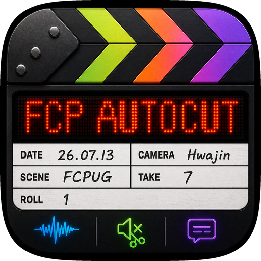

  

<h1 align="center">FCP AutoCut (beta)</h1>

  파이널컷 프로젝트를 드래그하면 — <b>무음을 잘라내고 자막을 입혀</b> 다시 파이널컷으로 돌려주는 맥앱. 
  모든 처리는 <b>내 Mac 안에서만</b> 이루어집니다. 영상이 외부 서버로 나가지 않습니다.

---

## 다운로드

👉 **[Releases](../../releases)** 페이지에서 최신 DMG를 받으세요. 설치 후 **앱 안의 "지금 업데이트" 버튼**으로 이후 버전을 바로 받을 수 있습니다.

| 요구 사항 | |
|---|---|
| Mac | **Apple Silicon (M1 이상)** — Intel Mac 미지원 |
| macOS | 14 (Sonoma) 이상 |
| Final Cut Pro | 10.x ~ 12.3 |
| 디스크 | 최초 1회 AI 음성 모델 약 **3.5GB** (선택 기능은 추가 다운로드) |

> 💬 **베타 테스터 오픈채팅방** — 설치 도움 · 버그 제보 · 업데이트 소식 · 기능 요청은 여기로!
> 👉 **[카카오톡 오픈채팅 참여하기](https://open.kakao.com/o/grDKAwCi)**

## 주요 기능

- **파이널컷 직접 드래그 입력** — FCP 브라우저에서 프로젝트를 앱에 바로 드롭 (`.fcpxmld`/`.fcpxml`도 가능)
- **무음컷 (비파괴)** — 무음 구간만 자동 제거. 어저스트먼트 레이어·B롤·보조 스토리라인·컷 구조를 **전부 보존**하고 침묵만 걷어냅니다
- **자막 자동화** — 로컬 AI 음성 인식(Qwen3-ASR) + 단어 단위 정밀 타이밍(Forced Aligner)
- **의미 단위 자막 분리 엔진** — 문장 전체를 보고 **가장 자연스러운 분리 조합**을 계산(동적계획법). 보조용언("말하고 싶은")·의존명사("수 있도록")·숫자+단위("열한 명")·접속부사를 쪼개지 않습니다. 문장별 예외가 아닌 **단일 일반 로직**
- **결과물 2종** — ① 원본 타임라인 + 자막 ② 무음 제거로 압축된 타임라인 + 자막
- **작업 소요 시간 표시** + **앱 내 자동 업데이트**
- **100% 로컬 처리** — 영상·음성이 Mac 밖으로 나가지 않습니다

### 자막 다듬기 (선택)

사이드바 **자막 다듬기** 섹션에서 켤 수 있는 정교화 옵션들:

| 옵션 | 하는 일 | 비고 |
|---|---|---|
| **화자 분리** | 화자별로 다른 색 Video Role 부여 (한 자막에 두 화자 안 섞임) | |
| **용어 사전 치환** | 설정에 등록한 고유명사·용어로 자막을 통일 (예: "제리안이"→"정예린이", 조사 보존) | 즉시·무료, 모델 불필요 |
| **AI 의미 분리** | 규칙 분리를 언어모델(Qwen2.5-14B)이 의미 단위로 다듬음 | **스크립트 없음**(규칙만)·**스크립트 기반**(항상)·**자동**(낭독/자유발화 판별) 중 선택. 켜면 최초 1회 ~8GB 다운로드 |

> **AI 의미 분리 = 자동**을 쓰면 앱이 전사문을 보고 낭독체/자유발화를 스스로 판별해, 대본 영상에만 언어모델을 적용하고 군말 많은 인터뷰는 규칙 분리로 빠르게 처리합니다.

### 조절 가능한 옵션

자막 자동화 · 언어 선택 · 자막 형식(타이틀/캡션/둘 다) · 글자 크기 · 자막 길이 · 빈틈없이 채우기 ·
무음컷 · 컷 강도 · 군소리 컷("어/음/아") · 다시 말하기 컷 · 화자 분리 · 용어 사전 치환 · AI 의미 분리

## 성능

- **자막 인식·정밀 타이밍**: 영상 길이에 비례 (M1 기준 대략 실시간의 몇 배 빠르게 처리)
- **자막 분리·용어 치환**: 규칙 기반이라 **즉시** (모델 불필요)
- **AI 의미 분리(선택)**: 문장마다 언어모델을 돌려 느립니다 — 30분 영상 10분+, 낭독체에서 이득. 자유발화엔 **자동 모드**가 알아서 생략합니다
- 처리 시간은 완료 화면에 **"소요 시간"**으로 표시됩니다

## 설치 & 첫 실행

1. DMG를 열고 **FCP AutoCut**을 **Applications 폴더로** 드래그
2. **보안 해제 (한 번만)** — 베타는 Apple 공증 전이라 처음에 macOS가 차단합니다
   1. 앱 더블클릭 → "열 수 없습니다" 경고에서 **[완료]**
   2. **시스템 설정 → 개인정보 보호 및 보안** → 아래로 스크롤
   3. "'FCP AutoCut'이(가) 차단되었습니다" 옆 **[그래도 열기]** → **[열기]** → Mac 암호 입력
   - 안 되면 터미널에서: `xattr -cr "/Applications/FCP AutoCut.app"`
3. 앱 안내에 따라 AI 음성 모델 **[다운로드]** (최초 1회, 약 3.5GB — 진행률은 상단에 표시)
4. **디스크 접근 권한 (한 번만)** — 미디어가 외장/NAS/다운로드 폴더에 있으면 첫 실행 온보딩 안내에 따라 전체 디스크 접근 권한을 켜주세요. **앱을 업데이트해도 권한·모델은 유지됩니다**

## 사용법 — 3단계

1. **넣기** — 파이널컷에서 프로젝트를 잡아 앱의 점선 박스로 드래그
2. **실행** — 원하는 옵션을 켠 뒤 실행. 진행 상황과 소요 시간이 표시됩니다
3. **돌려받기** — 결과 파일을 잡아 파이널컷으로 드래그 → **새 프로젝트로 import**(원본 비파괴)

## 업데이트

새 버전이 나오면 앱 상단에 배지가 뜹니다. **"지금 업데이트"**를 누르면 최신 버전을 앱이 직접 내려받아 자동으로 열어줍니다 — 뜬 창에서 앱을 Applications로 드래그하면 끝.

## 개인정보

- 음성 인식·자막·무음컷 등 **모든 처리가 로컬(내 Mac)에서** 이루어집니다
- 영상·음성 파일이 외부 서버로 전송되지 않습니다
- 네트워크는 **AI 모델 최초 다운로드**와 **업데이트 확인**에만 사용됩니다

## 피드백 🙏

앱 하단의 **[피드백]** 버튼으로 의견을 보내주세요. 오류가 났다면 **[로그 다운로드]**로 저장한 로그를 함께 첨부해주시면 큰 도움이 됩니다.

실시간 소통은 **[카카오톡 오픈채팅방](https://open.kakao.com/o/grDKAwCi)**에서 — 설치 문의·버그·요청 환영합니다.

- 베타 버전은 **30회**까지 사용할 수 있습니다
- 버전별 변경 사항: [CHANGELOG.md](CHANGELOG.md)
- 환경·프로젝트 유형별 호환성: [COMPATIBILITY.md](COMPATIBILITY.md)
